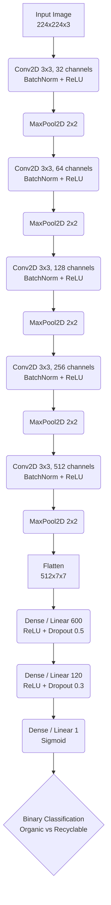

# ♻️ Waste Classification App


A state-of-the-art Web Application built with **Streamlit** and powered by a custom **Convolutional Neural Network (CNN)** trained in **PyTorch**. This application allows users to upload or capture an image of waste and instantly classifies it as either **Organic** or **Non-organic (Recyclable)**.

The frontend is designed with a premium, responsive **Apple Crystal Glassmorphism** UI, providing a beautiful user experience across devices.

---

## 📊 Dataset & Preprocessing

The model is trained on a categorized dataset of waste images divided into `TRAIN` and `TEST` splits. 

To improve model generalization and prevent overfitting, we applied robust **Data Augmentation** during training. 

### Transformations Applied

| Phase | Transformations | Parameters |
| :--- | :--- | :--- |
| **Training** | Resize | `(224, 224)` |
| | Random Horizontal Flip | `p=0.5` |
| | Random Rotation | `degrees=25` |
| | To Tensor | Standard PyTorch conversion |
| | Normalize | `mean=[0.485, 0.456, 0.406]`, `std=[0.229, 0.224, 0.225]` |
| **Inference/Testing** | Resize | `(224, 224)` |
| | To Tensor | Standard PyTorch conversion |
| | Normalize | `mean=[0.485, 0.456, 0.406]`, `std=[0.229, 0.224, 0.225]` |

---

## 🧠 Model Architecture

The custom CNN model (`wasteCNN`) follows a deep architecture designed to extract high-level features from waste images effectively. 

### Architecture Flowchart



### Regularization Details (Dropout)
To combat overfitting in the fully connected (Dense) layers, aggressive **Dropout** was implemented:
- **`Dropout(0.5)`** after the first Dense layer (600 units).
- **`Dropout(0.3)`** after the second Dense layer (120 units).
- **Batch Normalization** (`BatchNorm2d`) is heavily utilized after every single Convolutional layer to stabilize and accelerate training.

---

## 📈 Training & Results

The model was trained for **10 Epochs** using Binary Cross Entropy Loss (`BCELoss`) and the Adam optimizer. 

By the end of the training cycle, the model demonstrated excellent convergence:
* **Final Validation Loss:** `0.2165`
* **Final Validation Accuracy:** `91.37%`

The model weights with the highest validation accuracy were exported and saved as `best_waste_classifier.pt`.

---

## 💻 Web Application Features

The frontend (`app.py`) is built purely in Python using **Streamlit**.
- **Crystal Glassmorphism UI:** Complete CSS overhaul providing a dynamic, blurred, glassy aesthetic over a fluid abstract background.
- **Multi-Input Support:**
  - File Uploader (Drag & Drop or browse for `.jpg`, `.png`).
  - Native Phone Camera integration (`st.camera_input`) for real-time picture taking on mobile devices.
- **Fast Inference:** PyTorch state dictates are mapped to CPU explicitly, allowing the web app to run seamlessly on environments without dedicated GPUs.

---

## ⚙️ Setup & Installation

Follow these steps to run the Web App locally:

1. **Clone the repository and navigate to the folder:**
   ```bash
   git clone <repository-url>
   cd waste-classification-cnn-project-main
   ```

2. **Install dependencies:**
   Make sure you have Python installed. It is highly recommended to use a virtual environment.
   ```bash
   pip install -r requirements.txt
   ```

3. **Run the Streamlit App:**
   ```bash
   python -m streamlit run app.py
   ```

4. **Access the Application:**
   Open your browser and navigate to `http://localhost:8501`.

---

## 📁 Project Structure

```text
├── app.py                      # Main Streamlit Web Application
├── best_waste_classifier.pt    # PyTorch saved model weights
├── waste_management.ipynb      # Jupyter Notebook (Model Training, Architecture, EDA)
├── requirements.txt            # Python dependencies
└── README.md                   # Project Documentation
```
